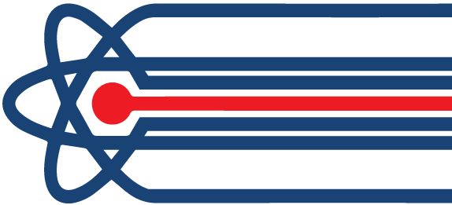

<p align="center">
  <a href="https://danilo-zekovic.github.io/react-tableql" rel="noopener" target="_blank"></a>
</p>
<h1 align="center">react-tableql</h1>
<h6 align="center">Easy to use React components for creating data grids with zero to no configuration. Simple way to display your data.</h6>
<div align="center">
  
  
  
  
  
  
</div>
<div align="center">
  
  
  
</div>
<div align="center">
  
</div>

## Installing and Using react-tableql

First install

`npm install react-tableql`
or
`yarn install react-tableql`

Then import it into your React component:

`import TableQL from 'react-tableql'`

or for ApolloTableQL:

`import { ApolloTableQL } from 'react-tableql'`

Component in which ApolloTableQL is used must be wrapped in Apollo Client Provider:

```
ReactDOM.render(
  (
    <ApolloProvider client={client}>
      <App />
    </ApolloProvider>
  ),
  document.getElementById('root')
)
```

For more information how to setup Apollo Client please visit their Get Started page: https://www.apollographql.com/docs/react/essentials/get-started.html

## Docs

For detailed examples and API visit the documentation.

[Documentation Content](docs/README.md)

- Coming soon
